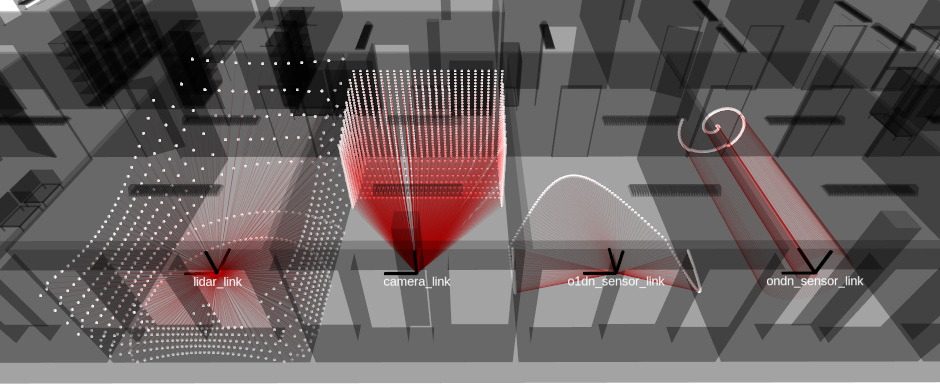
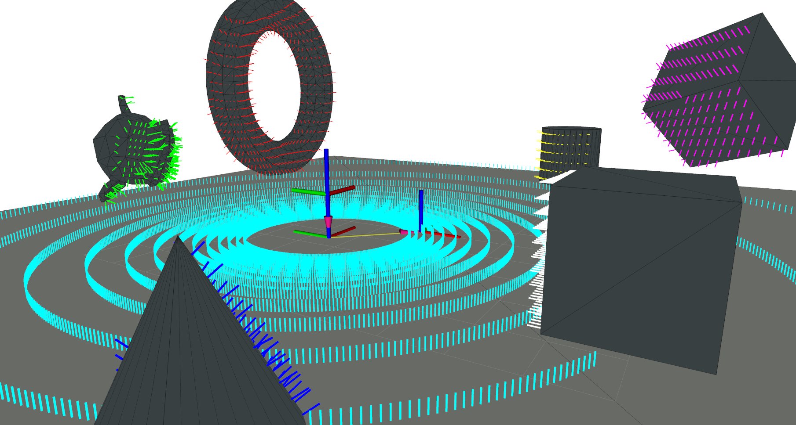

<div align="center">
<h1>
Rmagine
</h1>
<h4 align="center">A robot wants to simulate too</h4>
</div>

<div align="center">
  <a href="https://github.com/uos/rmagine">Code</a>
  <span>&nbsp;&nbsp;•&nbsp;&nbsp;</span>
  <a href="https://uos.github.io/rmagine_docs">Documentation</a>
  <span>&nbsp;&nbsp;•&nbsp;&nbsp;</span>
  <a href="https://youtube.com/playlist?list=PL9wBuzh6ev07faQ13tXH9mhL5Wk6r34JM">Videos</a>
  <span>&nbsp;&nbsp;•&nbsp;&nbsp;</span>
  <a href="https://github.com/uos/rmagine/issues">Issues</a>
  <span>&nbsp;&nbsp;•&nbsp;&nbsp;</span>
  <a href="https://github.com/amock/rmagine_examples">Examples</a>
  <span>&nbsp;&nbsp;•&nbsp;&nbsp;</span>
  <a href="https://github.com/amock/rmagine_viewer">Viewer</a>
  <br />
</div>

## Description

Library for fast and accurate simulation of range sensors in large 3D environments using ray tracing. 
The simulations can even be computed on embedded devices installed on a robot. 
Rmagine has been specifically developed to

- perform multiple sensor simulations simultaneously and in realtime
- distribute computations to various devices: CPU, GPU, RTX..
- hold data at device of computation
- reduce graphical overhead (offscreen-rendering)
- solve runtime critical tasks


| Spherical, Pinhole or fully customizable models. | Query several attributes at intersection. |
|:----:|:----:|
|   |      |

## Installation / Usage

See [Wiki](https://uos.github.io/rmagine_docs) page for further instructions.

## Example

This examples shows how to simulate ranges of 100 Velodyne VLP-16 sensor using Embree backbone. First, the following headers need to be included:

```c++
// Map
#include <rmagine/map/EmbreeMap.hpp>
// Sensor models
#include <rmagine/types/sensor_models.h>
// Predefined sensor models: e.g. VLP-16
#include <rmagine/types/sensors.h>
// Simulators
#include <rmagine/simulation/SphereSimulatorEmbree.hpp>

namespace rm = rmagine;
```

The following code loads a map "my_mesh.ply" and simulates 100 Velodyne VLP-16 scans from certain predefined poses. Hits and Ranges are chosen as intersection attributes.

```c++
// loading a map from disk
std::string path_to_mesh = "my_mesh.ply";
rm::EmbreeMapPtr map = rm::import_embree_map(path_to_mesh);

// defining a sensor model
// We use a predefined VLP-16 sensor model here
rm::SphericalModel sensor_model = rm::vlp16_900();

// construct a simulator. set sensor model and 
// map to operate on
rm::SphereSimulatorEmbree sim;
sim.setModel(sensor_model);
sim.setMap(map);

// 100 Transformations between base and map. e.g. poses of the robot
rm::Memory<rm::Transform, rm::RAM> Tbm(100);
for(size_t i=0; i < Tbm.size(); i++)
{
    rm::Transform T = rm::Transform::Identity();
    T.t = {2.0, 0.0, 0.0}; // position (2,0,0)
    rm::EulerAngles e = {0.0, 0.0, 1.0}; // orientation (0,0,1) radian - as euler angles
    T.R.set(e); // euler internally converted to quaternion
    Tbm[i] = T; // Write Transform/Pose to Memory
}

// add your desired attributes at intersection here
// - optimizes the code at compile time
// Possible Attributes (rmagine/simulation/SimulationResults.hpp):
// - Hits
// - Ranges
// - Points
// - Normals
// - FaceIds
// - GeomIds
// - ObjectIds
using ResultT = rm::Bundle<
    rm::Hits<rm::RAM>, 
    rm::Ranges<rm::RAM>
>;
// for querying all attributes at once we provide the 'rm::IntAttrAll'-type 
// instead of 'ResultT' for convenience

ResultT result = sim.simulate<ResultT>(Tbm);
// result.hits, result.ranges contain the resulting attribute buffers
std::cout << "printing the first ray's range: " << result.ranges[0] << std::endl;

// or slice the results for the scan of pose 5
auto ranges5 = result.ranges(5 * sensor_model.size(), 6 * sensor_model.size());
std::cout << "printing the first ray's range of the fifth scan: " << ranges5[0] << std::endl;
```

More detailed examples explaining each step and how to customize it to your needs are explained in the [Wiki](https://uos.github.io/rmagine_docs). More examples can be found here: https://github.com/amock/rmagine_examples.

## Citation

Please reference the following papers when using the Rmagine library in your scientific work.

```bib
@inproceedings{mock2023rmagine,
  title={{Rmagine: 3D Range Sensor Simulation in Polygonal Maps via Ray Tracing for Embedded Hardware on Mobile Robots}}, 
  author={Mock, Alexander and Wiemann, Thomas and Hertzberg, Joachim},
  booktitle={IEEE International Conference on Robotics and Automation (ICRA)}, 
  year={2023},
  doi={10.1109/ICRA48891.2023.10161388}
}
```

The paper is available on [IEEE Xplore](https://ieeexplore.ieee.org/document/10161388) and as preprint on [arXiv](https://arxiv.org/abs/2209.13397).


## Rmagine-accelerated Applications
- [rmagine_viewer](https://github.com/amock/rmagine_viewer)
- [rmagine_gazebo_plugins](https://github.com/uos/rmagine_gazebo_plugins)
- [RMCL](https://github.com/uos/rmcl)
- [radarays_ros](https://github.com/uos/radarays_ros)

## Contributions

We welcome contributions of all kinds, including issues, pull requests, and feedback, to help us enhance this OpenSource project.
If you'd like to enhance the [documentation](https://uos.github.io/rmagine_docs/), whether by fixing spelling errors or adding examples, don't hesitate to submit issues or pull requests in the repository at https://github.com/uos/rmagine_docs.

## News

### Sep 12th 2024

Alongside the new version 2.2.6 we released a minimal viewer that demonstrates the sensor models of rmagine. Check it out here: [https://github.com/amock/rmagine_viewer](https://github.com/amock/rmagine_viewer).

### Dec 5th 2023

New version 2.2.2 is available now and brings convenience updates for ROS-users. Just place Rmagine into your ROS-workspace and it will compile. Via `find_package(rmagine COMPONENTS [...])` you can still find Rmagine's components as if you would install it globally on your system. We tested it with 
- ROS1 - noetic
- ROS2 - humble

Normally you would set `OptiX_INCLUDE_DIR` via cmake flags. Now we provide an additional option: Set the environment variable `OPTIX_HEADER_DIR` for example in your `.bashrc`-file:

```bash
export OPTIX_INCLUDE_DIR=~/software/optix/NVIDIA-OptiX-SDK-7.4.0-linux64-x86_64/include
```

Especially if you place Rmagine into your ROS-workspace this option becomes very handy.

[Older news ...](https://uos.github.io/rmagine_docs/extra/news/)

