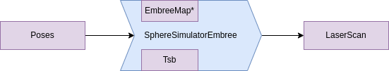
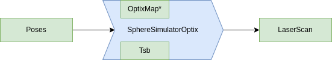
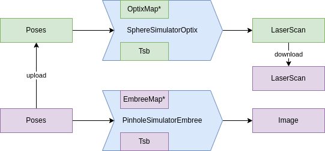

# imagine - Fast LiDaR simulation in 3D environments

Library for fast sensor data simulation in large 3D environments.

## Design Goals

Mainly designed for robotic applications:

- Perform multiple sensor simulations simultaneously and in realtime
- Perform computations at specific computing devices (CPU, GPU..)
    - Hold data at device of computation
    - Minimal graphical overhead (offscreen-rendering)
- Runtime critical operations
- Easy to use 

## Examples


## Supported Models


## Installation


## Usage

The general computing flow is as follows. 


Tsb is the transform from sensor to base frame. Or spoken: The sensor pose relative to the robot base. The map can be either a pointer to an `EmbreeMap` or `OptixMap`. The Prefix of the `Simulator` is either `Embree` for CPU computation or `Optix` for GPU computation. The suffix of the Simulator is dependend on which sensor model you want to simulate. A few examples:

- `SphereSimulatorEmbree` - Simulate a velodyne on CPU
- `PinholeSimulatorOptix`- Simulate a depth camera on GPU
- `O1DnSimulatorOptix` - Simulate a custom `O1DnModel` on GPU 

### Example 1: Simulate 1000 3D LiDaRs on CPU

Now we want to construct the following pipeline.



```cpp

#include <imagine/simulation/SphereSimulatorEmbree.hpp>

using namespace imagine;

SphereSimulatorEmbreePtr construct_simulator(std::string path_to_mesh)
{
    // Default construct the SphereSimulatorEmbree as shared pointer
    SphereSimulatorEmbreePtr sim(new SphereSimulatorEmbree);

    EmbreeMapPtr map = importEmbreeMap(path_to_mesh);
    sim->setMap(map);

    // Define sensor model
    SphericalModel model;
    // TODO: fill with model specific parameters
    sim->setModel(model);

    // Set static transform between sensor and base (optional)
    Transform Tsb;
    Tsb.setIdentity();
    sim->setTsb(Tsb);

    return sim;
}

int main(int argc, char** argv)
{
    // Load map and set map pointer to simulator
    std::string path_to_mesh = argv[1];
    SphereSimulatorEmbreePtr sim = construct_simulator(path_to_mesh);

    // Define 1000 poses to simulate from
    Memory<Transform, RAM> poses(1000);
    for(int i = 0; i<poses.size(); i++)
    {
        poses[i].setIdentity();
    }

    // Result: Simulate Ranges
    Memory<float, RAM> ranges = sim->simulateRanges(poses);

    return 0;
}

```

### Example 2: Simulate 1000 LiDaRs on GPU


Now we want to construct the following pipeline.



The green cells are memory objects on GPU as you see in the following code snippet.


```cpp

#include <imagine/simulation/SphereSimulatorOptix.hpp>

using namespace imagine;

SphereSimulatorOptixPtr construct_simulator(std::string path_to_mesh)
{
    // Default construct the SphereSimulatorEmbree as shared pointer
    SphereSimulatorOptixPtr sim(new SphereSimulatorOptix);

    OptixMapPtr map = importOptixMap(path_to_mesh);
    sim->setMap(map);

    // Define sensor model
    SphericalModel model;
    // TODO: fill with model specific parameters
    sim->setModel(model);

    // Set static transform between sensor and base (optional)
    Transform Tsb;
    Tsb.setIdentity();
    sim->setTsb(Tsb);

    return sim;
}

int main(int argc, char** argv)
{
    // Load map and set map pointer to simulator
    std::string path_to_mesh = argv[1];
    SphereSimulatorOptixPtr sim = construct_simulator(path_to_mesh);

    // Define 1000 poses to simulate from
    Memory<Transform, RAM> poses(1000);
    for(int i = 0; i<poses.size(); i++)
    {
        poses[i].setIdentity();
    }

    Memory<Transform, VRAM_CUDA> poses_;
    // upload from CPU to GPU
    poses_ = poses;

    // Result: Simulate Ranges
    Memory<float, VRAM_CUDA> ranges_ = sim->simulateRanges(poses_);

    // download from GPU to CPU
    // or use CUDA buffer for other computations
    Memory<float, RAM> ranges;
    ranges = ranges_;

    return 0;
}

```


### Example 3: Simulate 1000 LiDaRs on GPU and Images on CPU


Now we want to construct the following pipeline.




```cpp

#include <imagine/simulation/SphereSimulatorOptix.hpp>
#include <imagine/simulation/PinholeSimulatorEmbree.hpp>

using namespace imagine;

int main(int argc, char** argv)
{
    // Load map and set map pointer to simulator
    std::string path_to_mesh = argv[1];

    // CONSTRUCTION PART

    // Define Simulators
    SphereSimulatorOptix lidar_sim_gpu;
    PinholeSimulatorEmbree dcam_sim_cpu;
   
    // Load and set maps
    OptixMapPtr map_gpu = importOptixMap(path_to_mesh);
    EmbreeMapPtr map_cpu = importEmbreeMap(path_to_mesh);
    lidar_sim_gpu.setMap(map_gpu);
    dcam_sim_cpu.setMap(map_cpu);


    // Define models
    SphericalModel lidar_model;
    PinholeModel dcam_model;
    lidar_sim_gpu.setModel(lidar_model);
    dcam_sim_cpu.setModel(dcam_model);

    // Define static transforms (optional)
    Transform T_lidar_base;
    Transform T_dcam_base;
    lidar_sim_gpu.setTsb(T_lidar_base);
    dcam_sim_cpu.setTsb(T_dcam_base);

    // SIMULATION PART

    Memory<Transform, RAM> poses(1000);
    // TODO: fill poses
    
    Memory<Transform, VRAM_CUDA> poses_;
    // upload from CPU to GPU
    poses_ = poses;

    // Simulate Depth cameras ranges on CPU
    Memory<float, RAM> dcam_ranges
        = dcam_sim_cpu.simulateRanges(poses);

    // Simulate LiDaRs ranges on GPU
    Memory<float, VRAM_CUDA> lidar_ranges_ 
        = lidar_sim_gpu.simulateRanges(poses_);

    // Download lidar ranges
    Memory<float, RAM> lidar_ranges;
    lidar_ranges = lidar_ranges_;

    // Results are in dcam_ranges and lidar_ranges

    return 0;
}

```


