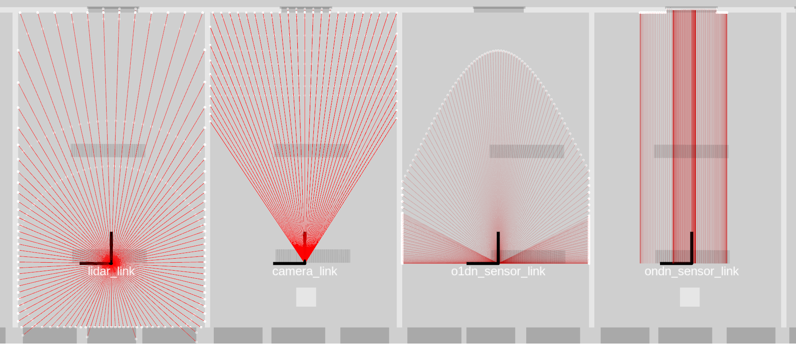

[[Code](https://github.com/uos/rmagine)] [[Wiki](https://github.com/uos/rmagine/wiki)]

# rmagine - Fast Depth-Sensor simulation in 3D environments

Library for fast sensor data simulation in large 3D environments.

## Design Goals

Mainly designed for robotic applications:

- Perform multiple sensor simulations simultaneously and in realtime
- Perform computations at specific computing devices (CPU, GPU, RTX..)
    - Hold data at device of computation
    - Minimal graphical overhead (offscreen-rendering)
- Runtime critical operations

## Sensor Models

Spherical, Pinhole or fully customizable models.

## Intersection Attributes

Query several attributes at intersection.

## Usage

See [Wiki](https://github.com/uos/rmagine/wiki) page for further instructions.

## Code
Is available on Github: [rmagine](https://github.com/uos/rmagine)

## Rmagine-accelerated Applications
- [rmagine_gazebo_plugins](https://github.com/uos/rmagine_gazebo_plugins)
- [RMCL](https://github.com/uos/rmcl)

## Publications

Please reference the following papers when using the Rmagine library in your scientific work.

**Rmagine: 3D Range Sensor Simulation in Polygonal Maps via Raytracing for Embedded Hardware on Mobile Robots**
- State: submitted at ICRA 2023
- Preprint: https://arxiv.org/abs/2209.13397
